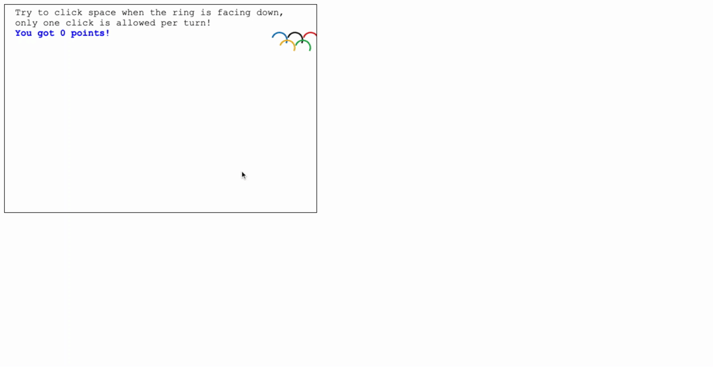

# Magic Olympic Rings (Assignment 3 and 4)

## Assignment 3 - Part 1: Draw an object
I draw the olympic symbol(Olympic rings) using html5 canvas. :page_facing_up: olympic_part1.html

## Assignment 3 - Part 2: Apply transformation to a hierarchical object
To apply transformations to a hierarchical model, I translate the whole olympic symbol while scaling and rotating each small ring separately. :page_facing_up: olympic_part2.html

## Assignment 4 - Part 1: Add user interaction
The player is supposed to click 'space' when the gap in olympic rings points directly to the bottom. If successful, the screen will show that the player scored 100 points. :page_facing_up: olympic_part3.html

## Assignment 4 - Part 2: Implement fixed-time step, variable rendering loop